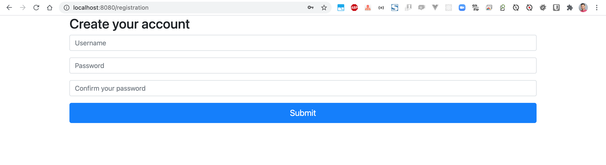
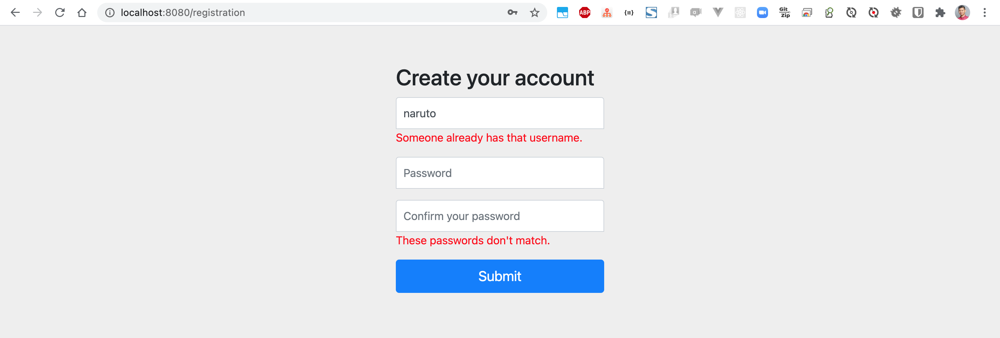
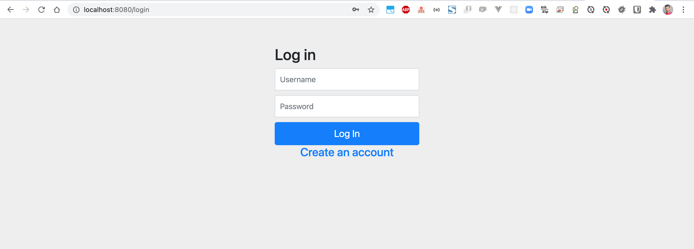
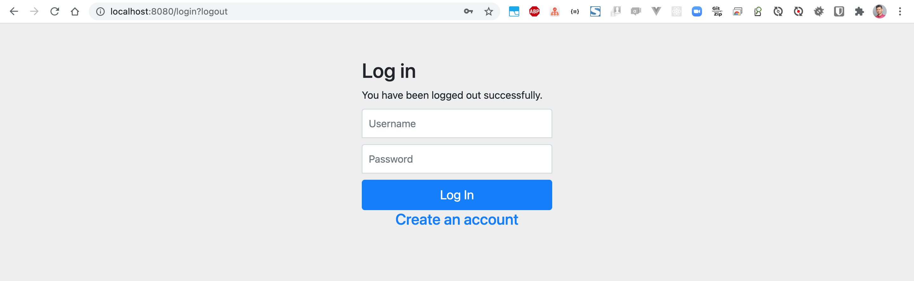
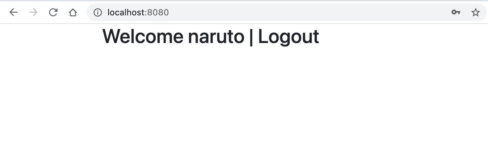

# springboot-registration-login
### Things todo list:
1. Clone this repository: `git clone https://github.com/hendisantika/springboot-registration-login.git`
2. Go inside the folder: `cd springboot-registration-login`
3. Run docker compose: `docker-compose up`
4. Open your favorite browser: http://localhost:8080

### Image Screen shot

Registration Page

Login Page

Welcome Page

